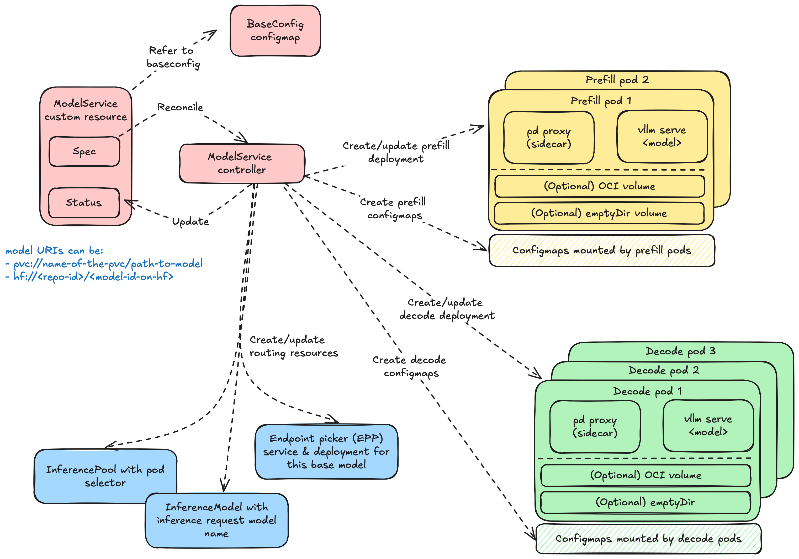

# Model Service

`ModelService` is a Kubernetes operator (CRD + controller) that enables the creation of inference workloads and routing resources for a given base-model. 

Serving a base-model using `ModelService` involves creating a couple of Kubernetes objects.

- `BaseConfig` configmap: this is typically created by the platform owner, and specifies configuration that is common across multiple base-models.

- `ModelService` custom resource: this is typically created by the inference model owner; it specifies configuration that is specific to a given base-model, and can optionally refer to a `BaseConfig`.



## Template support & reconciliation

The values in the `baseconfig` configmap, and certain values in `modelservice` resource can be templated. When the `modelservice` resource is reconciled:

1. Template variables in `baseconfig` and `modelservice` are dynamically interpolated based on the `modelservice` spec.
2. A semantic merge takes place between `baseconfig` and `modelservice`.
3. Inference workloads, routing resources, and RBACs authorizations needed for running the base-model are dynamically created in the cluster.

## Key Features

- Enables disaggregated prefill
- Supports creation of [Gateway API Inference Extension](https://gateway-api-inference-extension.sigs.k8s.io) resources for routing
- Supports auto-scaling of prefill and decode deployments with HPA and/or other auto-scalers
- Supports independent scaling of prefill and decode instances
- Supports independent node affinities for prefill and decode instances
- Supports model loading from OCI images, HuggingFace public and private registries, and PVCs
- Supports templating for `baseconfig` values and certain `modelservice` values.

## Samples

Refer to the [`samples` folder](samples).

## Run `ModelService` locally

### Create kind cluster

```sh
kind create cluster
```
### Install InferenceModels and InferencePool CRDs

```sh
VERSION=v0.3.0
kubectl apply -f https://github.com/kubernetes-sigs/gateway-api-inference-extension/releases/download/$VERSION/manifests.yaml
```

### Running controller

```sh
make install && make run
```

### Uninstall

```sh
make uninstall && make undeploy 
```

### Delete cluster
```sh
kind delete cluster
```

### ModelService dry run
View the components that ModelService will create given a ModelService CR and a base config ConfigMap. 

Make sure you are at the root directory of `llm-d-model-service`

```
cd llm-d-model-service
go run main.go generate --modelservice <path-to-msvc-cr> --baseconfig <path-to-baseconfig>
```

For example

```
go run main.go generate -m samples/facebook/msvc.yaml -b samples/facebook/baseconfig.yaml > output.yaml
```

And `output.yaml` will contain the YAML manifest for the resources that ModelService will create in the cluster. This feature purely for development purposes, and is intended to provide a quick way of debugging without a cluster. Note that some fields will not be included, such as `owner references` and `name` which require a cluster.